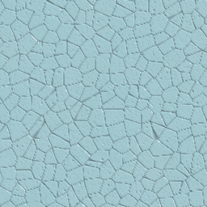
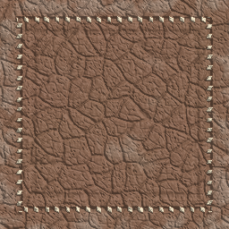
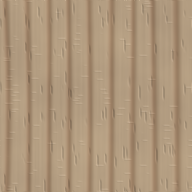
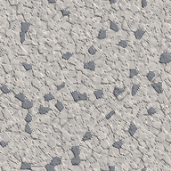
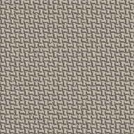
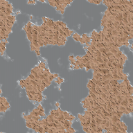

<p align="center">
  
</p>

<p align="center"><code>deterministic procedural materials · browser workbench · CLI · MCP</code></p>

---

> **TAIGA's Texture** is a compact procedural-material laboratory built around **GRAIN**, a deterministic field-graph DSL that can be authored by people or driven by an LLM.

Edit materials in the browser, inspect PBR channels and a cube preview, then automate the same engine through the CLI or MCP.

## `[ MATERIAL GALLERY ]`

<table>
  <tr>
    <td align="center"><br><sub>CRACKLE CERAMIC</sub></td>
    <td align="center"><br><sub>SADDLE LEATHER</sub></td>
    <td align="center"><br><sub>QUARTER-SAWN OAK</sub></td>
  </tr>
  <tr>
    <td align="center"><br><sub>GRANITE</sub></td>
    <td align="center"><br><sub>WAXED CANVAS</sub></td>
    <td align="center"><br><sub>RUSTED STEEL</sub></td>
  </tr>
</table>

## Features

- **GRAIN DSL** — pure, forward-only fields with deterministic seeds and compile-time cost limits.
- **Material workbench** — live source editing, PBR channel views, tiling checks, parameter sliders, and an interactive studio-lit cube.
- **Procedural library** — ceramic, leather, stitched leather, oak, granite, canvas, rusted steel, marble, and multiscale parched earth.
- **LLM tool surface** — structured validation diagnostics, deterministic analysis, PNG rendering, multiscale inspection, CLI, and stdio MCP.
- **No runtime packages** — the browser workbench is one HTML file; the automation tools use Node.js built-ins.

## Run locally

Clone the repository and open [`grain-bench.html`](./grain-bench.html) in a WebGL 2 capable browser.

```bash
git clone https://github.com/kawaiiTaiga/taigas-texture.git
cd taigas-texture
```

On Windows:

```powershell
Start-Process .\grain-bench.html
```

Optional verification:

```bash
npm test
```

## CLI

```bash
# Discover bundled and library materials
node grain-cli.mjs examples --json

# Validate one example
node grain-cli.mjs validate --example saddle --json

# Render PBR views
node grain-cli.mjs render --example ceramic --out renders/ceramic --resolution 256 --json

# Inspect the same point across scales
node grain-cli.mjs render-scales materials/parched-earth.grain \
  --out renders/parched-earth --zooms 1,4,16,64 --center 0.5,0.5 --json
```

## MCP

Start the dependency-free stdio server:

```bash
node grain-mcp-server.mjs
```

Example MCP configuration:

```json
{
  "mcpServers": {
    "taigas-texture": {
      "command": "node",
      "args": ["<ABSOLUTE_PATH>/grain-mcp-server.mjs"]
    }
  }
}
```

Exposed tools:

- `list_material_examples`
- `get_material_example`
- `validate_material`
- `render_material`
- `render_material_multiscale`

## Material example

```grain
seed = 17
tile = 1
var glaze_h = 0.53

field cells = worley(u, v, freq=15, jitter=1, out=edge, seed=3)
field crack = 1 - smoothstep(0.004, 0.052, cells)
field h = clamp(0.52 - 0.11*crack, 0, 1)

out height = h
out albedo = hsv(glaze_h, 0.42, 0.72*(1 - 0.48*crack))
out rough = clamp(0.20 + 0.44*crack, 0, 1)
out metal = 0
```
